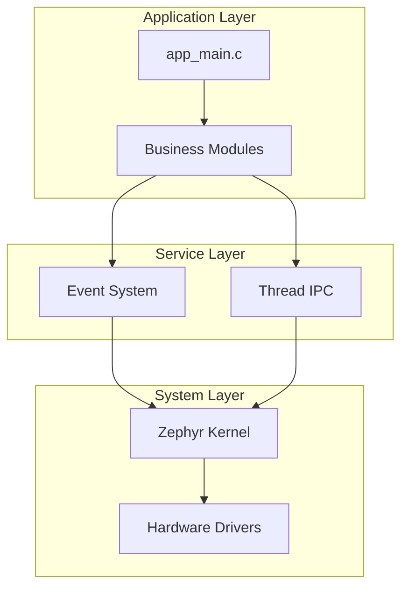

> Language: [中文](../../zh-CN/80-贡献与维护/82-文档改进建议.md) | **English**

# Documentation Improvement Suggestions (Newcomer Friendliness)

This document analyzes **shortcomings** of documents under `docs/` and proposes **specific improvement suggestions** to help newcomers get started faster.

**Analysis Date**: 2026-04-01  
**Analysis Scope**: All 26 documents in `docs/` directory

---

## 1. Current Assessment

### ✅ What's Done Well

| Document | Strengths |
|----------|----------|
| **Environment Setup Guide.md** | Detailed steps, covering Windows/Linux/macOS, comprehensive troubleshooting |
| **CI Platform Configuration Guide.md** | Truly "hands-on", step-by-step screenshot-style instructions |
| **Documentation Index.md** | Clear learning path classification (A/B/C/D/E paths) |
| **FAQ and Troubleshooting.md** | Comprehensive high-frequency questions, clear resolution approaches |
| **Developer Getting Started Guide.md** | Complete daily development flow, practical checklists |

### ⚠️ Areas Needing Improvement

| Issue Type | Specific Manifestations | Impact |
|------------|------------------------|--------|
| **Missing quick start guide** | No "see results in 5 minutes" path | Newcomers may give up during environment setup |
| **Insufficient visual content** | Almost all text, lacking architecture diagrams, flowcharts | Abstract concepts hard to understand |
| **Prerequisites scattered** | Python/West/CMake version requirements spread across multiple docs | Newcomers don't know what to install first |
| **Windows pain points scattered** | PowerShell policy, path format issues scattered everywhere | High frustration rate for Windows users |
| **Missing "first LED" tutorial** | No complete example from zero to hardware control | After learning, don't know how to control hardware |
| **Terminology explanations not accessible** | Terms like "standalone app", "Devicetree overlay" lack one-sentence explanations | High barrier to entry for newcomers |
| **Missing video/animation** | Key steps have no visual reference | Operational steps hard to replicate |

---

## 2. Suggested New Documents

### 1. 📖 **5-Minute Quick Experience.md** (New)

**Target readers**: People who want to quickly see what this project can do

**Content outline**:
```markdown
# 5-Minute Quick Experience

## Prerequisites (only 2 needed)
- Python 3.8+ (verify: `python --version`)
- Repository cloned

## Step 1: Install West (1 minute)
```bash
pip install west
```

## Step 2: Configure Paths (2 minutes)
```bash
copy zephyr_config.env.template zephyr_config.env
# Edit file, fill in your Zephyr path (if you have one)
```

## Step 3: Build and Run (2 minutes)
```bash
# Use native_posix (no development board needed)
west build -b native_posix .
# Run compiled artifact
./build/zephyr/zephyr.exe
```

## What Do You See?
- Log output examples
- Shell command demonstration

## Next Steps
- Read [Environment Setup Guide.md](../10-Environment/11-Environment-Setup-Guide.md) for complete environment setup
- Read [Developer Getting Started Guide.md](../00-Getting-Started/04-Developer-Getting-Started.md) to start development
```

**Priority**: 🔴 High (newcomer first touchpoint)

---

### 2. 📊 **Project Architecture Visualization Guide.md** (New)

**Target readers**: Visual learners who want to understand overall architecture

**Content outline**:
```markdown
# Project Architecture Visualization Guide

## 1. Directory Structure at a Glance
```
[Use Mermaid or images to show src/ directory relationships]
```

## 2. Event System Workflow
```
[Flowchart: Module A → Event System → Module B/C/D]
```

## 3. Startup Sequence Timing Diagram
```
[Timing diagram: SYS_INIT → module_manager_register → module_start]
```

## 4. Build Process
```
[Flowchart: west build → CMake → Devicetree → Compile → Link]
```

## 5. Memory Layout
```
[Memory diagram: Flash | RAM | Heap | Stack | Partitions]
```
```

**Priority**: 🟡 Medium (helps understanding, but doesn't block quick start)

---

### 3. 💡 **From Zero to Blinking LED.md** (New)

**Target readers**: Newcomers controlling hardware for the first time

**Content outline**:
```markdown
# From Zero to Blinking LED

## Goal
Make the onboard LED blink (example: Nucleo L4R5)

## Step 1: Confirm Your Development Board
- How to query onboard LED pin
- How to find LED node in device tree

## Step 2: Create Your First Module
```c
// Complete code example for src/modules/my_led.c
```

## Step 3: Configure Device Tree Overlay
```dts
// boards/my_board.overlay example
```

## Step 4: Compile and Flash
```bash
west build -b nucleo_l4r5zi .
west flash
```

## Step 5: Troubleshooting?
- Possible reasons LED won't blink
- How to check serial output

## Extended Reading
- [Device Tree and Memory Configuration Guide.md](../40-Application-Development/44-Device-Tree-Memory-Config-Guide.md)
- [Module System Detailed Usage Guide.md](../30-Core-Modules/32-Module-System-Detailed-Usage.md)
```

**Priority**: 🔴 High (hardware "Hello World")

---

### 4. 📋 **Terminology Quick Reference.md** (New)

**Target readers**: Quick lookup when encountering unfamiliar terms

**Content outline**:
```markdown
# Terminology Quick Reference

## Build Related
| Term | One-sentence Explanation | Typical Scenario |
|------|--------------------------|------------------|
| **West** | Zephyr's "package manager + build tool" | `west build`, `west flash` |
| **ZEPHYR_BASE** | Environment variable for Zephyr source directory | Will error if kernel not found during build |
| **overlay** | "Patch file" for development board device tree | Extend SRAM, add peripherals |
| **prj.conf** | Project's "configuration file" (enables which features) | Similar to menu configuration |
| **native_posix** | Run Zephyr simulation on PC | Test logic without development board |

## Code Related
| Term | One-sentence Explanation | Typical Scenario |
|------|--------------------------|------------------|
| **SYS_INIT** | Zephyr's "auto-initialization" macro | Module registration without manual calls |
| **Devicetree** | "Description file" for hardware configuration | Tells system what hardware exists |
| **Kconfig** | "Menu definition" for configuration options | Determines what can be written in prj.conf |
| **event_publish** | API to "send events" | Inter-module communication |
| **event_subscribe** | API to "subscribe to events" | Receive messages from other modules |

## Hardware Related
| Term | One-sentence Explanation | Typical Scenario |
|------|--------------------------|------------------|
| **Nucleo** | ST's development board series | Common test board |
| **UART** | Serial communication | Print logs to computer |
| **GPIO** | General Purpose Input/Output | Control LEDs, read buttons |
```

**Priority**: 🟢 Low (but practical, available for quick lookup anytime)

---

## 3. Suggested Improvements to Existing Documents

### 1. **Environment Setup Guide.md** Improvement Suggestions

**Current issues**:
- Prerequisites list too long, newcomers don't know where to start
- Windows user's PowerShell execution policy issue buried later

**Improvement suggestions**:
```diff
+ ## 0. Pre-installation Checklist (5 minutes)
+ Before starting, confirm the following are installed:
+ - [ ] Python 3.8+ (verify: `python --version`)
+ - [ ] Git (verify: `git --version`)
+ - [ ] Text editor (VSCode / Vim / other)
+
+ If not installed, first:
+ 1. Python: https://www.python.org/downloads/
+ 2. Git: https://git-scm.com/downloads
+
  ## Prerequisites

  Before configuring this project, ensure the following are installed:

- 1. **Zephyr SDK** - Download: https://github.com/zephyrproject-rtos/zephyr-sdk
- 2. **Zephyr Source Code** - Clone: https://github.com/zephyrproject-rtos/zephyr
- 3. **West** - Install via: `pip install west`
- 4. **CMake** (3.20.0 or higher)
- 5. **Python 3.8+**
+ ## 1. One-click Installation Script (recommended for beginners)
+
+ ```bash
+ # Auto-install West, CMake, Python dependencies
+ pip install west cmake
+ ```
+
+ ## 2. Get Zephyr (choose one)
+
+ ### Option A: Use official installation script (recommended)
+ [Link to Zephyr official installation guide]
+
+ ### Option B: Manual clone
+ [Existing content]
```

**Priority**: 🟡 Medium

---

### 2. **Developer Getting Started Guide.md** Improvement Suggestions

**Current issues**:
- "Post-template-copy checklist" too early, first-time readers may be intimidated
- Missing "minimal viable modification" example

**Improvement suggestions**:
```diff
  ## Quick Start

+ ### 30-second Build Test
+
+ ```bash
+ # Assuming you already have Zephyr environment
+ west build -b native_posix .
+ # Success if you see "Built ... zephyr"
+ ```
+
+ ### First Modification: Change the Log Output
+
+ 1. Open `src/app/app_main.c`
+ 2. Find `LOG_INF("...")`
+ 3. Change to your message
+ 4. Rebuild, run, see your output
+
  ### 1. Environment Configuration

  [Existing content]
```

**Priority**: 🟢 Low

---

### 3. **Documentation Index.md** Improvement Suggestions

**Current issues**:
- Learning paths clear but missing "estimated time"
- Newcomers don't know how long each path takes

**Improvement suggestions**:
```diff
  ### Path A: First Compile This Project (Zero Basics)

  0. (If **copying this repository as a new project**) First read **[README.md](../../../README.md)** "Initialize New Project from Template (Checklist)" and **[Developer Getting Started Guide.md](../00-Getting-Started/04-Developer-Getting-Started.md#post-template-copy-checklist)**, complete alignment of west, CMake, CI board, etc.
  1. **[Environment Setup Guide.md](../10-Environment/11-Environment-Setup-Guide.md)** — Install Zephyr SDK, West, CMake, Python; configure **`zephyr_config.env`**; verify **`west build`** passes.
+    ⏱️ Estimated time: 1-2 hours first time (including downloads), 10 minutes thereafter
+
  2. **[Standalone App Build Guide.md](../10-Environment/12-Standalone-App-Build-Guide.md)** — Understand "standalone app" directory structure, **`ZEPHYR_BASE`**, common **`west build`** parameters; custom board and overlay conventions.
+    ⏱️ Estimated time: 30 minutes
+
  3. If **changing development board**: **[Board Migration Guide.md](../10-Environment/13-Board-Migration-Guide.md)** — Complete board migration process, device tree adjustment, memory configuration, CI updates.
+    ⏱️ Estimated time: 1 hour (first time)
+
  4. **[Developer Getting Started Guide.md](../00-Getting-Started/04-Developer-Getting-Started.md)** — Project directory, `prj.conf` / `Kconfig` division of responsibilities, shortest flow for adding modules and events.
+    ⏱️ Estimated time: 1 hour
```

**Priority**: 🟢 Low (but thoughtful)

---

### 4. **FAQ and Troubleshooting.md** Improvement Suggestions

**Current issues**:
- Missing "error message → possible cause → solution" quick index
- Windows-specific issues not prominent enough

**Improvement suggestions**:
```diff
+ ## Quick Index (by Error Message)
+
+ | Error Message | Possible Cause | Solution |
+ |---------------|----------------|----------|
+ | `ZEPHYR_BASE not set` | Environment variable not configured | [Link](#11-zephyr_base_not_set) |
+ | `region RAM overflowed` | Insufficient memory | [Link](#21-region-ram-overflowed) |
+ | `'west' is not recognized` | Not installed or venv not activated | [Link](#12-west-not-found-in-terminal) |
+ | `Board 'xxx' not found` | Board not recognized | [Link](#23-board-xxx-not-found) |
+
  ## 1. Environment and Paths

  ### 1.1 `ZEPHYR_BASE not set` / Cannot Find Zephyr

  [Existing content]
```

**Priority**: 🟡 Medium

---

## 4. Other Improvement Suggestions

### 1. Add "Newcomers Start Here" in Root README

```markdown
## 🚀 Newcomers Start Here

| I want to... | Read this doc | Estimated Time |
|--------------|---------------|-----------------|
| **See results in 5 minutes** | [docs/en/00-Getting-Started/01-5-Minute-Quick-Experience.md](docs/en/00-Getting-Started/01-5-Minute-Quick-Experience.md) | 5 minutes |
| **Set up environment properly** | [docs/en/10-Environment/11-Environment-Setup-Guide.md](docs/en/10-Environment/11-Environment-Setup-Guide.md) | 1-2 hours |
| **Start coding** | [docs/en/00-Getting-Started/04-Developer-Getting-Started.md](docs/en/00-Getting-Started/04-Developer-Getting-Started.md) | 1 hour |
| **Control hardware (LED)** | [docs/en/00-Getting-Started/04-Developer-Getting-Started.md](docs/en/00-Getting-Started/04-Developer-Getting-Started.md) | 30 minutes |
| **Look up terminology** | [docs/en/00-Getting-Started/03-Terminology-Quick-Reference.md](docs/en/00-Getting-Started/03-Terminology-Quick-Reference.md) | Anytime |
```

**Priority**: 🔴 High (newcomer first touchpoint)

---

### 2. Add Architecture Diagram to README

Add Mermaid diagram to "Architecture Overview" section in root README:

```markdown
## Architecture Overview


```

**Priority**: 🟢 Low (but cool)

---

### 3. Create "Newcomer Starter Kit" Checklist

Create in `.github/` or `docs/`:

```markdown
# Newcomer Starter Kit Checklist

## Day 1
- [ ] Clone repository
- [ ] Run "5-Minute Quick Experience"
- [ ] Read [Documentation Index.md](../00-Getting-Started/02-Documentation-Index.md)

## Week 1
- [ ] Complete [Environment Setup Guide.md](../10-Environment/11-Environment-Setup-Guide.md)
- [ ] Successfully compile `native_posix`
- [ ] Successfully compile target development board
- [ ] Flash and see serial output

## Month 1
- [ ] Complete [From Zero to Blinking LED.md](From-Zero-to-Blinking-LED.md)
- [ ] Add your first module
- [ ] Understand how the event system works
- [ ] Participate in one code review
```

**Priority**: 🟢 Low (but helpful for long-term onboarding)

---

## 5. Priority Summary

| Improvement Item | Priority | Estimated Effort | Impact |
|------------------|----------|-----------------|--------|
| **New: 5-Minute-Quick-Experience.md** | 🔴 High | 1 hour | 🔴 High |
| **New: From-Zero-to-Blinking-LED.md** | 🔴 High | 2 hours | 🔴 High |
| **Improve: Add newcomer entry in root README** | 🔴 High | 30 minutes | 🔴 High |
| **New: Project Architecture Visualization Guide.md** | 🟡 Medium | 2 hours | 🟡 Medium |
| **Improve: Environment Setup pre-installation checklist** | 🟡 Medium | 30 minutes | 🟡 Medium |
| **Improve: FAQ quick index** | 🟡 Medium | 30 minutes | 🟡 Medium |
| **New: Terminology Quick Reference.md** | 🟢 Low | 1 hour | 🟢 Medium |
| **Improve: Documentation Index with estimated times** | 🟢 Low | 30 minutes | 🟢 Low |
| **New: Newcomer Starter Kit Checklist** | 🟢 Low | 30 minutes | 🟢 Low |

---

## 6. Implementation Suggestions

### Phase 1 (Immediate, complete within 1 day)
1. Create **5-Minute-Quick-Experience.md**
2. Update root **README.md** with "Newcomers Start Here" table
3. Add "Pre-installation Checklist" at beginning of **Environment Setup Guide.md**

### Phase 2 (Within 1 week)
1. Create **From-Zero-to-Blinking-LED.md**
2. Add quick reference table to **FAQ and Troubleshooting.md**
3. Create **Terminology-Quick-Reference.md**

### Phase 3 (Within 1 month)
1. Create **Project Architecture Visualization Guide.md** (with Mermaid diagrams)
2. Add estimated times to **Documentation Index.md**
3. Create **Newcomer-Starter-Kit-Checklist.md**

---

## 2026-05-09 Revision Record

This revision migrated the entire `docs/` tree to `docs/zh-CN/` and created new `docs/en/` English version.
For detailed plan, see [docs/superpowers/specs/2026-05-09-docs-bilingual-revamp-design.md](../../../docs/superpowers/specs/2026-05-09-docs-bilingual-revamp-design.md) (local file, not committed).

This sync covers the following code changes:
- Event system: Multi-level SLAB memory pool + cascade fallback
- Module manager: Compatibility layer (`module_manager_compat.h`), init lock external call semantics
- Thread IPC: Shared memory subsystem (`ipc_shm_*`), 4-parameter init signature
- System services: ~40 undocumented APIs now documented

---

*This document was generated by AI analysis; please adjust according to actual project conditions when implementing.*
