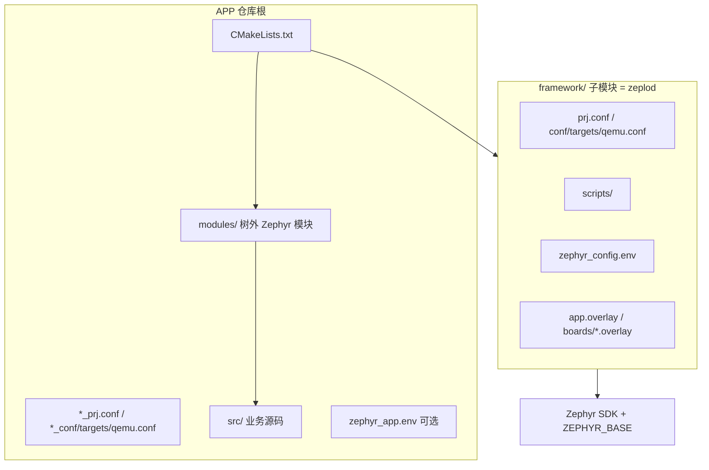

> 语言: **中文** | [English](../../en/10-environment-build/15-creating-new-app-guide.md)

> **本文档范围**：framework 子模块形态下从零创建 APP 仓库（CMake、Kconfig、overlay、`zephyr_app.env`、验收清单）。  
> **另见**：[12-Freestanding应用与构建基础](12-Freestanding应用与构建基础.md)（Freestanding 概念）· [14-QEMU仿真运行指南](14-QEMU仿真运行指南.md)（仿真）· [63-脚本与工具说明](../60-调试与排错/63-脚本与工具说明.md)（脚本）

# 新建 APP 开发指南

本文说明如何基于 **Zeplod（framework）** 创建**独立的业务 APP 仓库**：目录结构、必备文件、Kconfig / 设备树 / 脚本配置，以及实板与 QEMU 仿真的差异处理。

> **与 [12-Freestanding应用与构建基础.md](12-Freestanding应用与构建基础.md) 的关系**  
> 文档 12 讲解 Zephyr「独立应用（freestanding）」的通用概念（`ZEPHYR_BASE`、`BOARD_ROOT`、overlay 规则等）。  
> **本文聚焦「framework 子模块 + 业务 APP」这一推荐形态**，按步骤从零搭仓库。  
> 参考实现：[zephyr_gateway](https://github.com/QZehao/zephyr_gateway)（工业边缘网关）。

---

## 1. 两种工程形态

| 形态 | 适用场景 | 构建入口 | 脚本路径 |
|------|----------|----------|----------|
| **framework 本体**（zeplod） | 维护框架、跑示例模块、写框架级测试 | 仓库根 `west build -b <board> .` | `scripts/` |
| **APP 仓库**（推荐产品形态） | 业务固件、独立版本与 CI、framework 作为子模块升级 | APP 根 `west build -b <board> .` | `framework/scripts/` |

APP 仓库的典型关系：



**前置条件**：已完成 [11-环境搭建与配置指南.md](11-环境搭建与配置指南.md)，本机可成功构建 zeplod 本体。

---

## 2. 推荐目录结构

以项目名 `my_product` 为例（CMake `project(my_product)`）：

```
my_product/                          # Git 仓库根 = Zephyr 应用根
├── CMakeLists.txt                   # 顶层入口（必须）
├── APP_VERSION                      # 可选，单行 semver：1.0.0
├── my_product_prj.conf              # APP 专用 Kconfig 叠加（实板）
├── my_product_conf/targets/qemu.conf         # 可选，QEMU 仿真裁剪
├── my_product.overlay               # 可选，APP 专用设备树（实板）
├── zephyr_app.env                   # 可选，脚本与 CONF 覆盖
├── src/                             # 业务 C 源码（按模块分子目录）
│   └── ...
├── modules/
│   └── my_product/                  # 树外 Zephyr 模块
│       ├── zephyr/module.yml
│       ├── CMakeLists.txt
│       ├── Kconfig
│       └── ...
└── framework/                       # zeplod 子模块（勿改业务逻辑进 framework）
    ├── cmake/zeplod_app_overlays.cmake
    ├── prj.conf
    ├── conf/targets/qemu.conf
    ├── zephyr_config.env            # 从 template 复制，勿提交
    └── scripts/
```

命名约定（可被脚本自动发现）：

| 文件 | 命名规则 | 说明 |
|------|----------|------|
| Kconfig 实板片段 | `<工程名>_prj.conf` 或 `*_prj.conf` | 与 `framework/prj.conf` 合并 |
| Kconfig QEMU 片段 | `<前缀>_conf/targets/qemu.conf` | 与实板片段成对；关闭无仿真硬件的选项 |
| 设备树（可选） | `<工程名>.overlay` 或 `app.overlay` | 实板专用；勿把 STM32 SRAM 类 overlay 用于 QEMU |

---

## 3. 从零创建：步骤清单

### 3.1 创建仓库并引入 framework

```bash
mkdir my_product && cd my_product
git init
git submodule add <zeplod-repo-url> framework
git submodule update --init --recursive
```

### 3.2 配置 Zephyr 环境（在 framework 内）

```powershell
copy framework\zephyr_config.env.template framework\zephyr_config.env
# 编辑 ZEPHYR_BASE、ZEPHYR_SDK_INSTALL_DIR、QEMU_BIN_PATH 等
```

`zephyr_config.env` **放在 `framework/` 下**，不要提交到 Git。APP 根目录无需再放一份（除非团队另有约定）。

### 3.3 编写顶层 `CMakeLists.txt`

顶层文件负责：加载环境、合并 CONF、处理 overlay、注册树外模块、`find_package(Zephyr)`、`add_subdirectory(framework)`。

最小可编译模板（将 `my_product` 替换为你的工程名）：

```cmake
cmake_minimum_required(VERSION 3.20.0)

if(NOT CONF_FILE)
  set(CONF_FILE
      "${CMAKE_CURRENT_LIST_DIR}/framework/prj.conf;${CMAKE_CURRENT_LIST_DIR}/my_product_prj.conf"
      CACHE STRING "Zephyr application config files" FORCE)
endif()

# QEMU/native_sim：跳过 framework/app.overlay，改用 framework/boards/<board>.overlay
include(${CMAKE_CURRENT_LIST_DIR}/framework/cmake/zeplod_app_overlays.cmake)
zeplod_append_app_devicetree_overlays("${CMAKE_CURRENT_LIST_DIR}")

# 树外模块（也可写在 zephyr_app.env 的 ZEPHYR_EXTRA_MODULES）
if(NOT DEFINED ENV{ZEPHYR_EXTRA_MODULES} OR "$ENV{ZEPHYR_EXTRA_MODULES}" STREQUAL "")
  set(ENV{ZEPHYR_EXTRA_MODULES} "${CMAKE_CURRENT_LIST_DIR}/modules/my_product")
endif()

if(NOT DEFINED ENV{ZEPHYR_BASE})
  if(EXISTS "${CMAKE_CURRENT_LIST_DIR}/framework/zephyr_config.env")
    file(STRINGS "${CMAKE_CURRENT_LIST_DIR}/framework/zephyr_config.env" CONFIG_LINES)
    foreach(LINE ${CONFIG_LINES})
      if(NOT LINE MATCHES "^#" AND NOT LINE MATCHES "^$")
        string(REGEX MATCH "^([^=]+)=(.*)$" MATCH ${LINE})
        if(MATCH)
          set(ENV{${CMAKE_MATCH_1}} "${CMAKE_MATCH_2}")
        endif()
      endif()
    endforeach()
  else()
    message(FATAL_ERROR "ZEPHYR_BASE not set and framework/zephyr_config.env not found.")
  endif()
endif()

set(CMAKE_TRY_COMPILE_TARGET_TYPE STATIC_LIBRARY)

# 版本：APP 根 APP_VERSION > framework/APP_VERSION > 默认 1.0.0
if(EXISTS "${CMAKE_CURRENT_LIST_DIR}/APP_VERSION")
  file(READ "${CMAKE_CURRENT_LIST_DIR}/APP_VERSION" PROJECT_VERSION_RAW)
  string(STRIP "${PROJECT_VERSION_RAW}" PROJECT_VERSION_RAW)
  if(PROJECT_VERSION_RAW MATCHES "^([0-9]+)\\.([0-9]+)\\.([0-9]+)")
    set(PROJECT_VERSION_MAJOR ${CMAKE_MATCH_1})
    set(PROJECT_VERSION_MINOR ${CMAKE_MATCH_2})
    set(PROJECT_VERSION_PATCH ${CMAKE_MATCH_3})
    set(PROJECT_VERSION "${PROJECT_VERSION_MAJOR}.${PROJECT_VERSION_MINOR}.${PROJECT_VERSION_PATCH}")
  else()
    message(FATAL_ERROR "APP_VERSION must be X.Y.Z")
  endif()
else()
  set(PROJECT_VERSION "1.0.0")
endif()

find_package(Zephyr REQUIRED HINTS $ENV{ZEPHYR_BASE})
project(my_product VERSION ${PROJECT_VERSION})

set(MY_PRODUCT_TOPLEVEL_BOOTSTRAP ON)
add_subdirectory(framework)
```

要点：

- **`find_package(Zephyr)` 必须在 APP 根 CMakeLists**，Windows 上不能只在子目录调用。
- **`MY_PRODUCT_TOPLEVEL_BOOTSTRAP`**（或任意 `*_TOPLEVEL_BOOTSTRAP`）供 framework 识别「已被 APP 包装」，避免重复引导。
- **不要**在 APP 根无条件 `list(APPEND DTC_OVERLAY_FILE framework/app.overlay)`；使用 **`zeplod_append_app_devicetree_overlays()`**，否则 QEMU 会因 `sram0` 等节点报错。

### 3.4 创建 `my_product_prj.conf`

在 `framework/prj.conf` 之上叠加业务选项，例如：

```kconfig
# 启用树外模块中的业务代码
CONFIG_MY_PRODUCT_BUSINESS=y

# 关闭框架示例模块（按产品裁剪）
CONFIG_EXAMPLE_MODULE_A_ENABLE=n
CONFIG_EXAMPLE_MODULE_B_ENABLE=n

# 业务功能开关（在 modules/my_product/Kconfig 中定义）
# CONFIG_MY_PRODUCT_FEATURE_FOO=y
```

框架侧 `CONFIG_*` 释义见 [42-项目配置项说明.md](../40-应用开发/42-项目配置项说明.md)。

### 3.5 创建 `my_product_conf/targets/qemu.conf`（强烈建议）

实板启用的网络、CAN、Flash、NVS 等在 QEMU 上往往无对应设备，应单独裁剪：

```kconfig
CONFIG_NETWORKING=n
CONFIG_CAN=n
CONFIG_FLASH=n
CONFIG_NVS=n
# 关闭依赖上述硬件的业务 Kconfig
```

QEMU 构建时 CONF 合并顺序（脚本自动拼接）：

```text
framework/prj.conf → <app>_prj.conf → <app>_conf/targets/qemu.conf → framework/conf/targets/qemu.conf
```

详见 [14-QEMU仿真运行指南.md](14-QEMU仿真运行指南.md)。

### 3.6 树外 Zephyr 模块 `modules/my_product/`

`zephyr/module.yml` 示例：

```yaml
name: my_product
build:
  cmake: .
  kconfig: Kconfig
```

`CMakeLists.txt` 通过 `zephyr_library_sources_ifdef(CONFIG_MY_PRODUCT_BUSINESS ...)` 引用 **`../../src/`** 下的业务 `.c` 文件（与 zephyr_gateway 相同模式：源码在 APP 根 `src/`，模块元数据在 `modules/`）。

### 3.7 可选：`zephyr_app.env`

复制框架仓库根目录的 **`zephyr_app.env.template`** 到 APP 根。用于显式指定脚本行为（不配置时多数可自动发现）：

```bash
APP_PRJ_CONF=my_product_prj.conf
APP_PRJ_QEMU_CONF=my_product_conf/targets/qemu.conf
QEMU_CONF=framework/prj.conf;my_product_prj.conf;my_product_conf/targets/qemu.conf;framework/conf/targets/qemu.conf
ZEPHYR_EXTRA_MODULES=modules/my_product
```

### 3.8 首次构建与仿真

```powershell
cd my_product
.\framework\scripts\setup_env.ps1
.\framework\scripts\run_qemu.ps1 -BuildOnly -Board qemu_riscv32   # 先验证编译
.\framework\scripts\run_qemu.ps1                                  # 交互运行 QEMU
```

实板：

```powershell
west build -b nucleo_l4r5zi -d build . -p always
west flash -d build
```

---

## 4. 配置文件职责一览

| 文件 | 位置 | 作用 |
|------|------|------|
| `framework/zephyr_config.env` | framework/ | `ZEPHYR_BASE`、SDK、QEMU 路径、venv |
| `zephyr_app.env` | APP 根 | 覆盖 `APP_PRJ_CONF`、`QEMU_CONF` 等（可选） |
| `framework/prj.conf` | framework/ | 框架默认 Kconfig |
| `<app>_prj.conf` | APP 根 | 业务 Kconfig 叠加（实板 + 仿真基底） |
| `<app>_conf/targets/qemu.conf` | APP 根 | QEMU 专用裁剪 |
| `framework/conf/targets/qemu.conf` | framework/ | 框架仿真通用裁剪 |
| `framework/app.overlay` | framework/ | 框架默认实板 overlay（如 SRAM 扩展） |
| `framework/boards/qemu_*.overlay` | framework/ | QEMU 板型 overlay |
| `<app>.overlay` | APP 根 | APP 实板设备树（可选；通过 `DTC_OVERLAY_FILE` 或板级命名合并） |
| `APP_VERSION` | APP 根 | 应用版本号（优先于 framework） |

手动指定 CONF（覆盖 CMake 默认）：

```bash
west build -b nucleo_l4r5zi . -p always -- \
  -DCONF_FILE="framework/prj.conf;my_product_prj.conf"
```

---

## 5. 脚本与布局自动识别

`framework/scripts/project_layout.*` 根据 APP 根 `CMakeLists.txt` 是否包含 `add_subdirectory(framework)` 识别 **app 模式**：

| 能力 | framework 模式 | app 模式 |
|------|----------------|----------|
| 工作目录 | zeplod 根 | APP 根 |
| `setup_env` 读配置 | `./zephyr_config.env` | `./framework/zephyr_config.env` |
| QEMU CONF 合并 | `prj.conf;conf/targets/qemu.conf` | 自动拼接 `framework/prj.conf` + `*_prj.conf` + `*_conf/targets/qemu.conf` |
| `run_qemu.ps1` | `.\scripts\run_qemu.ps1` | `.\framework\scripts\run_qemu.ps1` |

常用命令：

```powershell
.\framework\scripts\setup_env.ps1
.\framework\scripts\run_qemu.ps1
.\framework\scripts\run_tests.ps1          # Windows 需 ZEPHYR_TEST_BOARD=qemu_riscv32
.\framework\scripts\qa.ps1 -Mode all
```

脚本细节见 [63-脚本与工具说明.md](../60-调试与排错/63-脚本与工具说明.md)。

---

## 6. 设备树注意事项

1. **`framework/app.overlay`** 面向框架默认实板（如 Nucleo L4R5ZI 的 SRAM），**不要**用于 `qemu_*` / `native_*`。
2. **`zeplod_append_app_devicetree_overlays()`** 在 QEMU 上自动选用 `framework/boards/<board>.overlay`。
3. APP 自有实板 overlay 可放在 APP 根，命名遵循 [44-设备树与内存配置手册.md](../40-应用开发/44-设备树与内存配置手册.md)（如 `boards/<board>.overlay`），或在 `CMakeLists.txt` 中在调用 `zeplod_append_app_devicetree_overlays` **之后**追加 `list(APPEND DTC_OVERLAY_FILE ...)`。
4. 换板完整流程见 [13-板型迁移指南.md](13-板型迁移指南.md)。

---

## 7. 业务开发接入框架

完成仓库骨架后，按框架文档开发业务：

1. [04-开发者入门指南.md](../00-入门/04-开发者入门指南.md) — 模块、事件、测试工作流  
2. [32-模块系统详细使用说明.md](../30-核心模块/32-模块系统详细使用说明.md) — `module_manager` 注册与生命周期  
3. [31-事件系统详细使用说明.md](../30-核心模块/31-事件系统详细使用说明.md) — 发布/订阅  
4. [37-数据总线使用说明.md](../30-核心模块/37-数据总线使用说明.md) — 流式数据（若需要）

---

## 8. 验收检查清单

创建或迁移 APP 仓库时，建议逐项确认：

- [ ] `git submodule` 已拉取 `framework/`，版本与团队对齐  
- [ ] `framework/zephyr_config.env` 已配置且未提交  
- [ ] APP 根 `CMakeLists.txt` 含 `add_subdirectory(framework)` 与 `zeplod_append_app_devicetree_overlays`  
- [ ] 存在 `<app>_prj.conf`，示例模块已按产品裁剪  
- [ ] 存在 `<app>_conf/targets/qemu.conf`，`run_qemu.ps1` 日志中 CONF 含四段合并  
- [ ] `modules/<name>/zephyr/module.yml` 与 `ZEPHYR_EXTRA_MODULES` 一致  
- [ ] `west build -b qemu_riscv32 . -p always` 通过（Windows 冒烟）  
- [ ] 目标实板 `west build -b <board> .` 通过  
- [ ] CI 中 `board`、CONF 与本地一致（见 [52-CI平台配置保姆级手册.md](../50-测试与CI/52-CI平台配置保姆级手册.md)）  
- [ ] 更新 framework 子模块后重跑 QEMU 与实板构建  

---

## 9. 常见问题

| 现象 | 原因 | 处理 |
|------|------|------|
| `undefined node label 'sram0'` | QEMU 合并了 `framework/app.overlay` | 使用 `zeplod_app_overlays.cmake`，升级 framework 子模块 |
| QEMU 仍编译网络/CAN | 缺少 `*_conf/targets/qemu.conf` 或子模块脚本过旧 | 添加 QEMU conf；更新 `framework/scripts/project_layout.*` |
| `ZEPHYR_BASE not set` | 未配置 `framework/zephyr_config.env` | 从 template 复制并填写 |
| 中文日志乱码（Windows） | 控制台 GBK vs 固件 UTF-8 | 使用新版 `run_qemu.ps1` 或见 [14-QEMU §8.11](14-QEMU仿真运行指南.md#811-windows-上中文日志乱码) |
| 脚本仍走 framework 模式 | 顶层 CMake 无 `add_subdirectory(framework)` | 修正 CMakeLists 或设 `ZEPHYR_APP_ROOT` |

更多排错：[62-常见问题与故障排除.md](../60-调试与排错/62-常见问题与故障排除.md)。

---

## 10. 参考

- 示例仓库：**zephyr_gateway**（`gateway_prj.conf` / `gateway_conf/targets/qemu.conf` / `modules/zephyr_gateway`）  
- [12-Freestanding应用与构建基础.md](12-Freestanding应用与构建基础.md) — freestanding 与 BOARD_ROOT  
- [14-QEMU仿真运行指南.md](14-QEMU仿真运行指南.md) — 仿真与 ztest  
- 框架仓库：`zephyr_app.env.template`、`cmake/zeplod_app_overlays.cmake`
