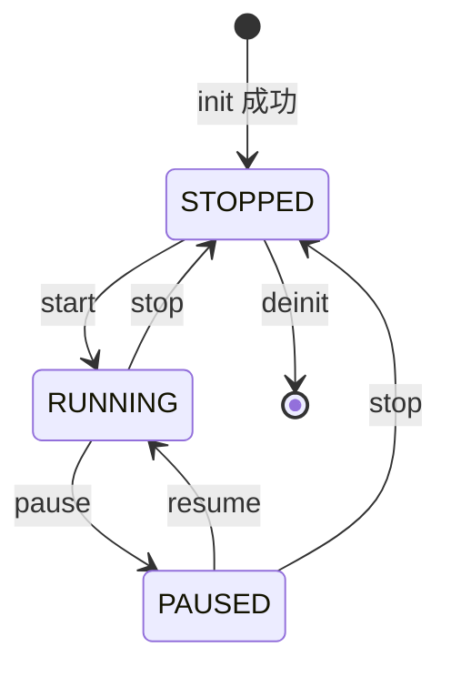
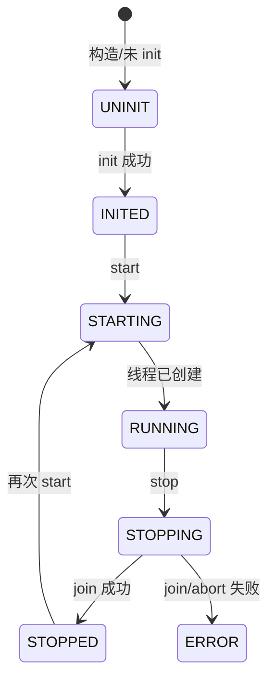
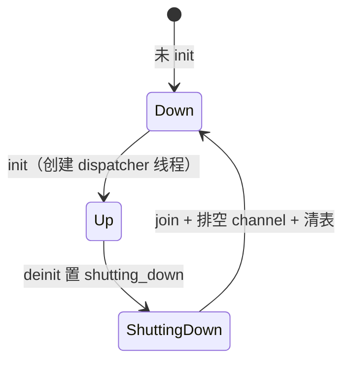

# 线程服务生命周期约定

> 日期：2026-05-28  
> 范围：`event_dispatcher`、`ipc_service`、`data_bus` 分发线程  
> 关联：[84-核心架构重构路线图](./84-核心架构重构路线图.md) P2、[tests/LIFECYCLE_CONTRACTS.md](../../../tests/LIFECYCLE_CONTRACTS.md)

本文档描述**当前实现**的语义对照表与未来对齐目标。行为变更须先更新本文档与 `LIFECYCLE_CONTRACTS.md`，再改代码与测试。

---

## 1. 术语对照

| 概念 | event_dispatcher | ipc_service | data_bus |
| --- | --- | --- | --- |
| 初始化 | `event_dispatcher_init` | `ipc_service_init` | `data_bus_init` |
| 启动线程 | `event_dispatcher_start` | `ipc_service_start`（worker + dispatcher） | `data_bus_init` 内创建线程 |
| 停止线程 | `event_dispatcher_stop` | `ipc_service_stop` | `data_bus_deinit`（含 join） |
| 反初始化 | `event_dispatcher_deinit` | 无独立 deinit（stop 清理 pending/shm） | `data_bus_deinit` |
| 运行标志 | `DISPATCHER_RUNNING` 等 | `running` + `zepl_state_machine` | `g_initialized` |
| 关闭信号 | `state == STOPPED` | `atomic shutdown` + 哑消息 | `g_shutting_down` + `k_sem_give` |
| Join 超时 | 500 ms（`ZEPL_THREAD_SERVICE_JOIN_TIMEOUT_MS`） | 同上 | 同上（`DATA_BUS_DISPATCHER_JOIN_TIMEOUT_MS`） |
| Join 失败 | 返回 `EVENT_ERR_TIMEOUT`，**不** abort | abort 后重试 join；失败 → `ZEP_STATE_ERROR`，返回 `-EIO` | 返回 `-EIO`，**不** abort，保持 `g_initialized` / `g_shutting_down` |
| 本线程 stop | `EVENT_ERR_INVALID_ARG` | `-EDEADLK`（worker 或 dispatcher） | `-EINVAL`（dispatcher 线程） |

---

## 2. 状态迁移（合法路径）

### event_dispatcher

### ipc_service（`zepl_state_machine`）

### data_bus

---

## 3. 跨服务一致策略（目标）

| 场景 | 目标语义 |
| --- | --- |
| 重复 stop/deinit（已停止） | 幂等成功（0 / `EVENT_OK`） |
| 重复 start（已运行） | `EVENT_OK` 或 `-EALREADY`，文档化且测试覆盖 |
| 从服务线程 stop/deinit | 统一拒绝（`EVENT_ERR_INVALID_ARG` / `-EINVAL` / `-EDEADLK`） |
| Join 超时 | 可观测错误码；允许安全重试 stop；禁止在旧线程仍存活时创建第二个消费者 |
| 停止时 in-flight 请求 | IPC：取消/唤醒 pending；Data Bus：drain 不 dispatch；Event：队列由 `event_system_stop` 约束 |

**已知差异（P2 后续 PR 收敛）**

- Event Dispatcher join 超时后**不** abort，保留 `thread_started` 以便重试（`EVENT_ERR_TIMEOUT`）。见 `test_dispatcher_stop_timeout_does_not_abort_callback`。
- Data Bus join 超时后**不** abort，保留 `g_initialized` / `g_shutting_down` 以便重试 `deinit`（`test_repeat_deinit_idempotent`）。
- IPC join 失败使用 `abort`+重试；失败后进入 `ZEP_STATE_ERROR` 并返回 `-EIO`。
- 错误码风格：Event 用 `event_status_t`，IPC/Data Bus 用负 errno。

**重试约定（当前实现）**

| 服务 | join 超时后再次 stop/deinit |
| --- | --- |
| event_dispatcher | 允许：第二次 `stop` 在回调结束后应 `EVENT_OK` |
| data_bus | 允许：再次 `deinit` 直至 join 成功或返回 `-EIO` |
| ipc_service | 进入 `ZEP_STATE_ERROR` 后需 `stop`+排查，不宜盲目 `start` |

---

## 4. 唤醒与排空

| 服务 | 唤醒阻塞线程 | 排空队列 |
| --- | --- | --- |
| event_dispatcher | 状态切 `STOPPED`，线程轮询退出 | 无独立 drain（依赖 `event_system`） |
| ipc_service | `shutdown=1` + request/response 哑消息 | `ipc_drain_queued_messages` + `k_msgq_purge` |
| data_bus | `shutting_down` + `g_dispatcher_sem` | `data_bus_drain_all_channels(false)` |

---

## 5. 实现检查清单（新增线程服务时）

1. 是否禁止从本服务线程 stop/deinit？
2. 重复 stop 是否幂等？
3. Join 是否有界？失败时是否避免双线程消费同一资源？
4. 停止路径是否唤醒所有阻塞在队列/信号量上的线程？
5. 是否有 `tests/LIFECYCLE_CONTRACTS.md` 条目与 ztest 用例？

---

## 6. 相关测试

| 模块 | 用例 |
| --- | --- |
| event_dispatcher | `test_lifecycle_start_stop_cycle`、`test_init_start_stop` |
| ipc_service | `test_multiple_start_stop_cycles`、`test_stop_without_start`、`test_duplicate_start_ealready` |
| data_bus | `test_init_deinit`、`test_repeat_deinit_idempotent`、`test_deinit_rejected_from_dispatcher_thread`、`test_channel_destroy_retries_after_publish` |
| ipc_service（CI） | `test_ipc_service` 套件（`prj.conf;prj_native_sim.conf`） |
